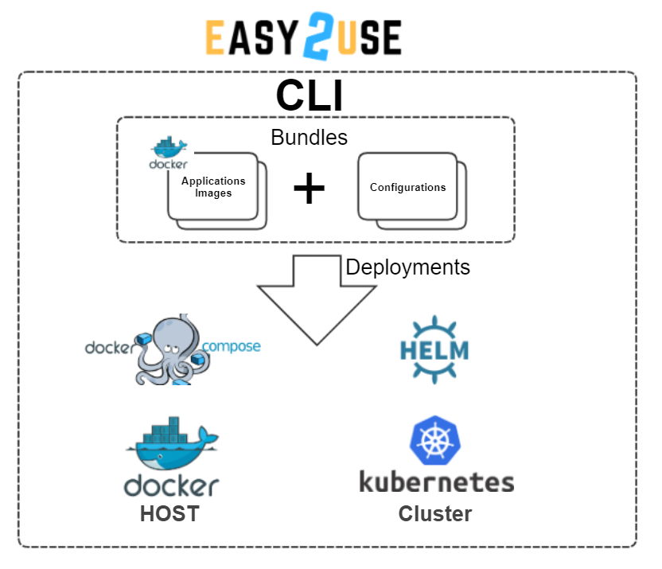

<!---
   Copyright 2019 Ericsson AB.
   For a full list of individual contributors, please see the commit history.

   Licensed under the Apache License, Version 2.0 (the "License");
   you may not use this file except in compliance with the License.
   You may obtain a copy of the License at

       http://www.apache.org/licenses/LICENSE-2.0

   Unless required by applicable law or agreed to in writing, software
   distributed under the License is distributed on an "AS IS" BASIS,
   WITHOUT WARRANTIES OR CONDITIONS OF ANY KIND, either express or implied.
   See the License for the specific language governing permissions and
   limitations under the License.
--->

# Eiffel Easy2Use
Eiffel Easy2Use is aiming to create an easy installation for any set of components in Docker containers on a dedicated Docker host or in a Kubernetes Cluster via Helm Charts (K8S package manager), with no or minimal configuration required to get started.

This Easy2Use space describes a Docker/Kubernetes easy set up sandbox environment. The environment aims at providing a portable and isolated demo/prototype sandbox for any Docker based application. It can even be run on your local laptop without any network access!

[Intro YouTube](https://www.youtube.com/watch?v=wFoTt4P_0Dg)

# Easy2Use CLI
The Easy2Use CLI supports standard docker-compose and helm charts for deploying pre-configured and ready to use applications/systems in Docker and Kubernetes target environments.

* Hiding HELM commands for K8S deployments
* Hiding docker-compose commands for Docker hosts deployments
* Hiding Kubectl commands for K8S deployments
* Injecting configuration for applications and systems at deployments

## Helm Versions Supported
The Easy2Use CLI supports Helm V2 & V3. Helm Version used is configurable via config-default.bash.

The Default version is V3.

Helm V2 can be configured in config-default.bash.

# Easy2Use Cheatsheet

# Included Bundles

* [GitLab](./wiki/gitlab/setup.md)
* [Cx](./wiki/cx/setup.md)
* [Eiffel](./wiki/eiffel/setup.md)

# About this repository
The contents of this repository are licensed under the [Apache License 2.0](./LICENSE).

To get involved, please see [Code of Conduct](https://github.com/eiffel-community/.github/blob/master/CODE_OF_CONDUCT.md) and [contribution guidelines](https://github.com/eiffel-community/.github/blob/master/CONTRIBUTING.md).

# About Eiffel
This repository forms part of the Eiffel Community. Eiffel is a protocol for technology agnostic machine-to-machine communication in continuous integration and delivery pipelines, aimed at securing scalability, flexibility and traceability. Eiffel is based on the concept of decentralized real time messaging, both to drive the continuous integration and delivery system and to document it.

Visit [Eiffel Community](https://eiffel-community.github.io) to get started and get involved.

# Documentation
1. [**Hosting Environments**](./wiki/Hosting_Environments.md)
2. [**Getting Started**](./wiki/Getting_Started.md)
3. [**Bundles**](./wiki/Bundles.md)
