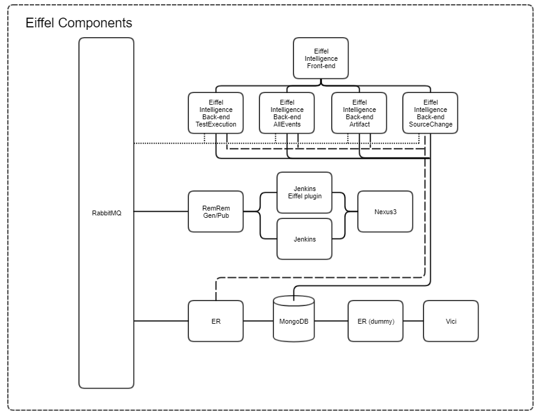

<!---
   Copyright 2020 Ericsson AB.
   For a full list of individual contributors, please see the commit history.

   Licensed under the Apache License, Version 2.0 (the "License");
   you may not use this file except in compliance with the License.
   You may obtain a copy of the License at

       http://www.apache.org/licenses/LICENSE-2.0

   Unless required by applicable law or agreed to in writing, software
   distributed under the License is distributed on an "AS IS" BASIS,
   WITHOUT WARRANTIES OR CONDITIONS OF ANY KIND, either express or implied.
   See the License for the specific language governing permissions and
   limitations under the License.
--->
# Components Included in Eiffel Bundle

Component | Service name | User/PSW | Info
------------- | ------------ | -------- | ----
Dummy Event Repository REST API | dummy_er | N/A | Needed for Vici for now
Eiffel Intelligence  (Frontend) | ei_frontend | N/A
Eiffel Intelligence (All Events) | ei_allevents | N/A
Eiffel Intelligence (Artifact) | ei_artifact | N/A | Subscription included (seeded) to trigger predefined Jenkins Job ei-artifact-triggered-job via native Jenkins Rest API
Eiffel Intelligence (SourceChange) | ei_sourcechange | N/A | Subscription included (seeded) to trigger predefined Jenkins Job ei-sourcechange-triggered-job via native Jenkins Rest API
Eiffel Intelligence (TestExecution) | ei_testexecution | N/A | Subscription included (seeded) to trigger predefined Jenkins Job ei-testexecution-triggered-job via native Jenkins Rest API
Eiffel Jenkins (with Eiffel Jenkins Plugin) | eiffel_jenkins | admin / admin | With predefined jobs showing some Eiffel service interactions with use of FEM plugin
Eiffel Message Bus (RabbitMQ) | rabbitmq | myuser / myuser | Same for both WebUI and AMQP connection
Event Repository REST API | eiffel_er | N/A
Jenkins	| jenkins | admin/admin | With predefined jobs showing some Eiffel service interactions using RemRem and Nexus via curl command.
MongoDb & Data Seeding | mongodb & mongo_seed | N/A | The seed-data folder in Easy2Use contains data that can be seeded into the MongoDB instance.
Nexus3 | nexus | admin / admin123 |
RemRem Generate | remrem_generate | N/A |
RemRem Publish | remrem_publish | N/A |
Vici | eiffel_vici | N/A

## Layout
This is a schematic picture of the environment:

