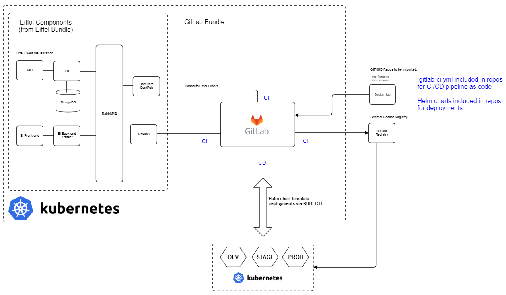
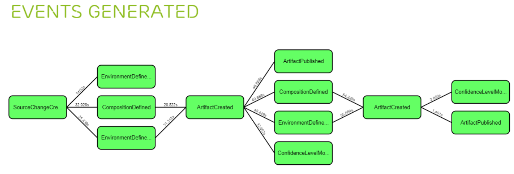

<!---
   Copyright 2019 Ericsson AB.
   For a full list of individual contributors, please see the commit history.

   Licensed under the Apache License, Version 2.0 (the "License");
   you may not use this file except in compliance with the License.
   You may obtain a copy of the License at

       http://www.apache.org/licenses/LICENSE-2.0

   Unless required by applicable law or agreed to in writing, software
   distributed under the License is distributed on an "AS IS" BASIS,
   WITHOUT WARRANTIES OR CONDITIONS OF ANY KIND, either express or implied.
   See the License for the specific language governing permissions and
   limitations under the License.
--->
# GitLab Bundle

## Idea
To provide a GitLab bundle with CI/CD pipeline as code setup which executes CI/CD pipeline build steps in Docker containers.

Dependent Eiffel services will be loaded from the Eiffel bundle to provide capability to log/visualize pipeline activities via Eiffel events.

### Included Features
CI:
 - 2 Java Microservices to be imported (ms-frontend & ms-backend) with .gitlab-ci.yml files
   - https://github.com/eiffelci/eiffel-ms-frontend-ci-test.git
   - https://github.com/eiffelci/eiffel-ms-backend-ci-test.git
 - GitLab CI engine with pipeline as code (ms-frontend & ms-backend)
 - Pre & post-merge pipelines
 - Eiffel event generated

CD:
 - CD Pipelines with kubectl deployment via HELM templates, helm charts included in ms-frontend & ms-backend microservices
 - Pre-merge CD pipeline (merge request) deployment to dev
 - Post-merge CD pipeline (merge request) deployment to stage
 - Deployment to production is triggered via manually decision in GiLab GUI
 - Immutable Docker Images are used together with microservices config injection to configure microservices in the different K8S target environments


The GitLab bundle is only applicable for deployments in Kubernetes.

## Bundle Name
The following name is used to refer to this bundle in the easy2use CLI:

GitLab

## Components included in Cx bundle
Component | Service name | User/PSW | Ingress | Info
------------- | ------------ | -------- | ------- | ------------
GitLab | gitlab_gitlab | NA | gitlab-\<domainname\> | user account needs to be created after startup
<b>Services Loaded from Eiffel Bundle*</b> | | |
RabbitMQ (Message Bus) | rabbitmq | myuser / myuser | eiffel-rabbitmq-\<namespace\>.\<domainname\>
MongoDB & Data Seeding | mongodb<br> mongo_seed | N/A | N/A | The seed-data folder in Easy2Use contains data that can be seeded into the MongoDB instance.
RemRem Generate | remrem_generate | N/A | eiffel-remrem-generate-\<namespace\>.\<domainname\>
RemRem Publish | remrem_publish | N/A | eiffel-remrem-publish-\<namespace\>.\<domainname\>
Nexus3 | nexus | admin/admin123 | eiffel-nexus3-\<namespace\>.\<domainname\>
Event Repository REST API | er | N/A | eiffel-er-\<namespace\>.\<domainname\>
Eiffel Vici | vici | N/A | eiffel-vici-\<namespace\>.\<domainname\>

## Resource Requirements
OS | Minimum Requirements | Preferably | Comments
------------- | ------------ | -------- | ----
Windows 'Docker Toolbox' | ? | 24 GB RAM <br> 50 GB Disk? | This recommendation is valid when assigning 4 CPU cores to the Docker machine.<br>With less cores less memory would be consumed, but the performance will be worse. The assigned amount of RAM will be allocated to the Docker machine until it is stopped
Windows 'Docker for Windows' | ? |20 GB RAM? <br> 50 GB Disk? | The assigned amount of RAM is dynamically allocated and only used by the Docker machine when needed?
Linux | 8 GB RAM |16 GB RAM or more |	~11 GB of RAM will be use under the load. <br>When all containers is loaded, the memory usage is ~6 GB RAM. <br> Computer with 8 GB RAM works, but it will takes some more time to load <br>all containers due to swapping data between memory and hard drive.

## Docker requirements
 - Docker 18.06 CE or newer
 - Docker-Compose 1.22 or newer

## Kubernetes requirements
 - Kubernetes cluster (local or remote)
 - Kubectl
 - Helm

## Dependencies
Eiffel bundle components

## Quick getting started guide with Easy2Use
See the getting starting page: Getting Started
[**Bundles**](./Getting_Started.md)

## Layout
This is a schematic picture of the environment:



## Principles

<br><br>


## Usage
### Bundle Information
Print bundle information from Easy2Use CLI:
```
./easy2use info GitLab
```

## Prerequisite local K8S cluster
If running in local K8S cluster, minikube or docker-for-windows (windows 10 Hyper-v). Local K8S cluster configuration is required.

  - Local K8S cluster (windows 10 Hyper-v) do:
  ```
  ./easy2use configure-local-k8s-hyper-v GitLab -t Kubernetes
  ```
  - Local K8S cluster (minikube) do:
  ```
  ./easy2use configure-local-k8s-minikube GitLab -t Kubernetes
  ```


## Start GitLab Bundle
Gitlab can only be deployed once per cluster (one ingress used).

Note: the GitLab startup can take a few minutes, so be patient!

###  Deploy GitLab bundle with all components including Argo

  ```
  ./easy2use start GitLab -t Kubernetes -n <namespace> -d <basedomainname>
  ```
   basedomain name is the basedomainname for the K8S cluster, if using local k8s kluster use ex. mylocalkube.com

   OBS You need to answer "Y" twice, first for the GitLab bundle installs and then the dependent services from the Eiffel bundle!

## List Service URLs, UserName & PSW
Easy2Use list command will both list URLs (ingresses) to the deployed K8S services and user/psw for the services.

  ```
  ./easy2use list GitLab -t Kubernetes -n <namespace>
  ```


  OBS For included Eiffel components do:
  ```
  ./easy2use list Eiffel -t Kubernetes -n <namespace>
  ```

## List HOSTS files entries for local K8S
If you running the GitLab bundle on a local K8S cluster, you need to update your ..etc/hosts file with ingresses. To print the ingresses to use do:


- Local K8S cluster (windows 10 Hyper-v) do:
  ```
  ./easy2use  generate-local-hosts-file-hyper-v GitLab -t Kubernetes
  ```

- Local K8S cluster (minikube) do:
  ```
  ./easy2use  generate-local-hosts-file-minikube GitLab -t Kubernetes
  ```

 Update your hosts file with the output from the printout!

 - Linux:  /etc/hosts
 - Windows: C:\Windows\System32\drivers\etc\hosts            (OBS you need to open cmd in Administrator mode!)

## Remove GitLab Bundle

The deployed applications ms-frontend & ms-backend (GitLab CD pipelines) will not be removed via Easy2Use CLI.

  ```
  ./easy2use remove GitLab -t Kubernetes -n <namespace> 
  ```

  OBS You need to answer "Y" twice, first for the GitLab bundle removals and then the dependent services from the Eiffel bundle!


### Additional removals
NA

## GitLab

### 1. Change password
 - Login to GitLab  (gitlab.\<domainname\>)
 - Change password

### 2. Register User
 - Click Rigister tab
 - Fill-in required text fields
 - Click Register

### 3. Import Projects
#### 3.1 Import ms-frontend
 - Click Create a project
 - Click Import project tab
 - Click git Repo by URL, add Git Repo URL:
    - https://github.com/eiffelci/eiffel-ms-frontend-ci-test.git
 - Tick Public
 - Click Create project
 - Click Settings -> CI/CD -> Expand Secrets variables:
 - Print vars to add via:
    - ./easy2use list GitLab -t Kubernetes -n <namespace>
 - Click Save variables

#### 3.2 Import ms-backend
 - Click New project (plus sign on top bar)
 - Click Import project tab
 - Click git Repo by URL, add Git Repo URL:
   - https://github.com/eiffelci/eiffel-ms-backend-ci-test.git
 - Tick Public
 - Click Create project
 - Click Settings -> CI/CD -> Expand Secrets variables:
 - Print vars to add via:
   - ./easy2use list GitLab -t Kubernetes -n <namespace>
 - Click Save variables

### 4. Start builds
 For both ms-fontend and ms-backend do:

 - Click CI/CD -> Run Pipeline -> Create pipeline

   After initial piplines are now executed, the piplines will be started when changes are commited & pushed from now on!

### 5 Deployments (CD) - ms-frontend & ms-backend
  - dev (CD only executed for merge-requests)
    - ms-frontend-dev-\<namespace\>.\<domainname\>/api/greeting
    - ms-backend-dev-\<namespace\>.\<domainname\>/api/hellobackend
  - stage (CD only executed on master branch changes)
    - ms-frontend-stage-\<namespace\>.\<domainname\>/api/greeting
    - ms-backend-stage-\<namespace\>.\<domainname\>/api/hellobackend       Info: 2 replicas created<br>
  - prod (CD only executed when manually triggered in pipeline)
    - ms-frontend-prod-\<namespace\>.\<domainname\>/api/greeting
    - ms-backend-prod-\<namespace\>.\<domainname\>/api/hellobackend        Info: 3 replicas created<br>


  Ingresses visible after deployement in cmd:
  - ./easy2use list GitLab -t Kubernetes -n <namespace>

## Known Issues
[**Easy2Use Issues**](https://github.com/eiffel-community/eiffel-easy2use/issues)
