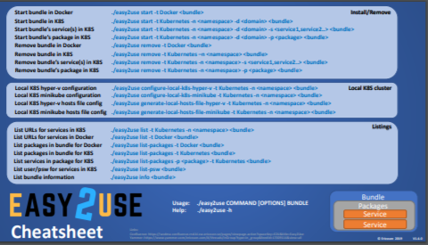

<!---
   Copyright 2019 Ericsson AB.
   For a full list of individual contributors, please see the commit history.

   Licensed under the Apache License, Version 2.0 (the "License");
   you may not use this file except in compliance with the License.
   You may obtain a copy of the License at

       http://www.apache.org/licenses/LICENSE-2.0

   Unless required by applicable law or agreed to in writing, software
   distributed under the License is distributed on an "AS IS" BASIS,
   WITHOUT WARRANTIES OR CONDITIONS OF ANY KIND, either express or implied.
   See the License for the specific language governing permissions and
   limitations under the License.
--->
# Getting Started

This section will give you the general description on how to get started running any of the provided bundles in Easy2Use.

# Prerequisites

To be able to run Easy2Use, make sure you have decided on a [**hosting environment**](./Hosting_Environments.md) and installed and/or set up client access for Docker/Minikube/etc accordingly.

# Client Setup
## Docker 
[**Install Docker**](https://docs.docker.com/v17.12/install/)

# Kubernetes
* Kubectl
  - 
  For manual administration of the Kubernetes cluster you could either use the Kubernetes Dashboard web GUI provided by your Kubernetes provider, or you could use the command line tool kubectl. Remember to set the environment variable KUBECONFIG to point to the config file for your Kubernetes cluster if you want to run kubectl commands towards your cluster.

  [**Install and Set Up kubectl**](https://kubernetes.io/docs/tasks/tools/install-kubectl/)
    
* Helm/Tiller
  - 
  To communicate with a Kubernetes cluster Easy2Use requires Helm to be installed on the client. After Helm is installed you should initialize the local helm CLI and install Tiller into your cluster by running 'helm init'.

  [**Install Helm**](https://helm.sh/docs/using_helm/)

* Remote Kubernetes Cluster
  - 
  If you intend to deploy on a remote Kubernetes Cluster you don't need any additional client setup.

* Kubernetes on Local Host (Windows with Hyper-V)
  - 
  This is when you intend to run Kubernetes on your local host and also access it locally. 
  ```
  ./easy2use configure-local-k8s-hyper-v
  ```

  Access Kubernetes dashboard via http://localhost:8001/api/v1/namespaces/kube-system/services/https:kubernetes-dashboard:/proxy/#!/login


* minikube on Local Host
  - 
  This is when you intend to run Kubernetes on your local host and also access it locally.
  ```
  ./easy2use configure-local-k8s-minikube
  ```

  Access Kubernetes dashboard
  ```
  minikube dashboard
  ```

* Kubeconfig
  - 
  To run Easy2Use with Kubernetes a Kubeconfig file need to be provided by pointing out the specific Kubernetes cluster config file by setting KUBECONFIG environment variable.

  If bash shell is used, KUBECONFIG environment variable is set by following command:
  ```
  export KUBECONFIG=/path/to/admin.conf
  ```
  
  Kubernetes cluster kubeconfig file is often named admin.conf, but can be named to something else. The important thing is the KUBECONFIG variable points on correct kubeconfig file.

  If you have several Kubernetes Kubeconfig files, then you can switch between the Kubeconfig files by updating the KUBECONFIG variable with the path to the other kubeconfig file and then execute the Easy2Use command.

  export KUBECONFIG=/path/to/another.admin.conf

# Quick Getting Started Guide

## Easy2Use Cheatsheet
<a href="../../docs/Easy2Use_CheatSheet.pdf" target="_blank"></a>

## Clone the Easy2Use repository

```
git clone https://github.com/eiffel-community/eiffel-easy2use.git
cd eiffel-easy2use
```

## Deploy Your Chosen Easy2Use Bundle
```
./easy2use start <bundle name>
```

## List Deployed Services and User & Passwords
```
./easy2use list <bundle name>
```

## Stop Deployed Services
```
./easy2use remove <bundle name>
```

## Easy2Use CLI Help
If you need to know more about the startup procedures please read the detailed guide below, or use the built-in help in Easy2Use:
```
./easy2use --help
```

## Easy2Use User Configuration

file ./config-user.bash

This file needs to be created manually, this file is not tracked by GIT.

Configuration examples for Cx bundle to configure Image registry :
```
# Image Registry and Repository
export CX_IMAGE_REGISTRY="registry.hub.docker.com"
export CX_IMAGE_REPOSITORY="myregistry"

# Argo Credentials for Image Registry 
export CX_IMAGE_REPOSITORY_ARGO_K8S_SECRET_USER="myuser"
export CX_IMAGE_REPOSITORY_ARGO_K8S_SECRET_PSW="mypassword"
```
See file ./config-default.bash for more configuration candidates.
